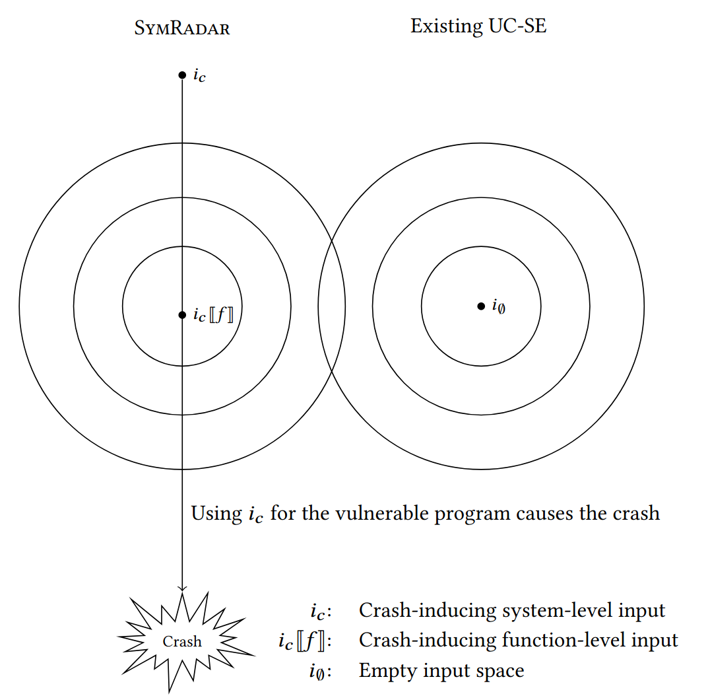

# SymRadar
<!--  -->
SymRadar is a patch verification tool with under-constrained symbolic execution on the patched function.
SymRadar works more efficiently by covering near the ciritical input-space area by extracting concrete snapshot and construct abstract snapshot to enable symbolic execution.

## Structure
### CPR
[CPR](https://cpr-tool.github.io/) is a automated vulnerability repair tool that generate patches for vulnerable program.
CPR's output is our main patch validation target.
This directory contains benchmarks and scripts for experiments.

### uni-klee
UNI-KLEE (**UN**der-constra**I**ned [KLEE](https://github.com/klee/klee)) is our implementation of KLEE-based symbolic execution tool, which supports under-constrained symbolic execution and lazy initialization.
It supports concrete snapshot extraction, abstract snapshot construction from concrete snapshot, and patch verification based on UC-SE and lazy initialization. Several optimizations and heuristics are applied to support such features.

## Getting Started
This is example with one subject. Check [CPR directory](./CPR) to run full experiments.
### 1. Docker image for experiments
```shell
docker pull symradar/symradar-replication:2025-04-21
docker run -d -it --name symradar symradar/symradar-replication:2025-04-21 bash
```

### 2. Running a simple example (libjpeg/CVE-2018-14498)
```shell
cd /root/projects/CPR
# Compile patches
sympatch.py single /root/projects/CPR/patches/extractfix/libjpeg/CVE-2018-14498/concrete
# Build target programs
symfeas.py build 14498
# Run filter
symvass.py filter 14498
# Run experiment
symvass.py rerun 14498 --sym-level=high -p high
```

Expected output:
```
patched
|-- cjpeg
|-- cjpeg.bc
|-- exploit.bmp
|-- filter/
|-- high-0/
|-- snapshot-high/
```
`filter` directory contains filter result: remaining patches that passed test is in `filter/filtered.json`
`snapshot-high` contains a concrete snapshot (`snapshot-high/snapshot-last.json`).
`high-0` is a directory containing our experiment results.

### 3. Analyzing the results
```
symvass.py analyze 14498 -p high
```
You can look `patched/high-0/table_v3.sbsv` file to get experiment result.
```log
[stat] [states] [original 12] [independent 504]
[sym-in] [id 1] [base 3] [test 8] [cnt 90] [patches [1, 46, 47, 48, 49, 50, 51, 52, 53, 54, 55, 56, 57, 58, 59, 60, 61, 62, 63, 64, 65, 66, 67, 68, 69, 70, 71, 72, 73, 74, 75, 76, 77, 78, 79, 80, 81, 82, 83, 84, 85, 86, 87, 88, 90, 91, 92, 93, 94, 95, 96, 97, 98, 99, 100, 101, 102, 103, 104, 105, 106, 107, 108, 109, 110, 111, 112, 113, 114, 115, 116, 117, 118, 119, 120, 121, 122, 123, 124, 125, 126, 127, 128, 129, 130, 131, 132, 176, 197, 198]]
[sym-in] [id 2] [base 4] [test 13] [cnt 90] [patches [1, 46, 47, 48, 49, 50, 51, 52, 53, 54, 55, 56, 57, 58, 59, 60, 61, 62, 63, 64, 65, 66, 67, 68, 69, 70, 71, 72, 73, 74, 75, 76, 77, 78, 79, 80, 81, 82, 83, 84, 85, 86, 87, 88, 90, 91, 92, 93, 94, 95, 96, 97, 98, 99, 100, 101, 102, 103, 104, 105, 106, 107, 108, 109, 110, 111, 112, 113, 114, 115, 116, 117, 118, 119, 120, 121, 122, 123, 124, 125, 126, 127, 128, 129, 130, 131, 132, 176, 197, 198]]
[sym-in] [id 3] [base 1] [test 19] [cnt 15] [patches [46, 78, 111, 122, 123, 124, 125, 126, 127, 128, 129, 130, 131, 132, 197]]
[remove] [crash] [id 1] [base 3] [test 8] [exit-loc /root/projects/CPR/patches/extractfix/libjpeg/CVE-2018-14498/src/rdbmp.c:157:17:71433] [exit-res ptr.err] [cnt 90] [patches [1, 46, 47, 48, 49, 50, 51, 52, 53, 54, 55, 56, 57, 58, 59, 60, 61, 62, 63, 64, 65, 66, 67, 68, 69, 70, 71, 72, 73, 74, 75, 76, 77, 78, 79, 80, 81, 82, 83, 84, 85, 86, 87, 88, 90, 91, 92, 93, 94, 95, 96, 97, 98, 99, 100, 101, 102, 103, 104, 105, 106, 107, 108, 109, 110, 111, 112, 113, 114, 115, 116, 117, 118, 119, 120, 121, 122, 123, 124, 125, 126, 127, 128, 129, 130, 131, 132, 176, 197, 198]]
[remove] [crash] [id 2] [base 4] [test 13] [exit-loc /root/projects/CPR/patches/extractfix/libjpeg/CVE-2018-14498/src/rdbmp.c:157:17:71433] [exit-res ptr.err] [cnt 90] [patches [1, 46, 47, 48, 49, 50, 51, 52, 53, 54, 55, 56, 57, 58, 59, 60, 61, 62, 63, 64, 65, 66, 67, 68, 69, 70, 71, 72, 73, 74, 75, 76, 77, 78, 79, 80, 81, 82, 83, 84, 85, 86, 87, 88, 90, 91, 92, 93, 94, 95, 96, 97, 98, 99, 100, 101, 102, 103, 104, 105, 106, 107, 108, 109, 110, 111, 112, 113, 114, 115, 116, 117, 118, 119, 120, 121, 122, 123, 124, 125, 126, 127, 128, 129, 130, 131, 132, 176, 197, 198]]
[remain] [crash] [id 3] [base 1] [test 19] [exit-loc /root/projects/CPR/patches/extractfix/libjpeg/CVE-2018-14498/src/rdbmp.c:155:17:71411] [exit-res ptr.err] [cnt 15] [patches [46, 78, 111, 122, 123, 124, 125, 126, 127, 128, 129, 130, 131, 132, 197]]
[strict] [id 1] [base 3] [test 8] [cnt 44] [patches [1, 68, 69, 70, 71, 72, 73, 74, 75, 76, 77, 78, 79, 80, 81, 82, 83, 84, 85, 86, 87, 88, 112, 113, 114, 115, 116, 117, 118, 119, 120, 121, 122, 123, 124, 125, 126, 127, 128, 129, 130, 131, 132, 198]]
[strict] [id 2] [base 4] [test 13] [cnt 44] [patches [1, 68, 69, 70, 71, 72, 73, 74, 75, 76, 77, 78, 79, 80, 81, 82, 83, 84, 85, 86, 87, 88, 112, 113, 114, 115, 116, 117, 118, 119, 120, 121, 122, 123, 124, 125, 126, 127, 128, 129, 130, 131, 132, 198]]
[strict] [id 3] [base 1] [test 19] [cnt 12] [patches [78, 122, 123, 124, 125, 126, 127, 128, 129, 130, 131, 132]]
[strict-remove] [crash] [id 1] [base 3] [test 8] [exit-loc /root/projects/CPR/patches/extractfix/libjpeg/CVE-2018-14498/src/rdbmp.c:157:17:71433] [exit-res ptr.err] [cnt 44] [patches [1, 68, 69, 70, 71, 72, 73, 74, 75, 76, 77, 78, 79, 80, 81, 82, 83, 84, 85, 86, 87, 88, 112, 113, 114, 115, 116, 117, 118, 119, 120, 121, 122, 123, 124, 125, 126, 127, 128, 129, 130, 131, 132, 198]]
[strict-remove] [crash] [id 2] [base 4] [test 13] [exit-loc /root/projects/CPR/patches/extractfix/libjpeg/CVE-2018-14498/src/rdbmp.c:157:17:71433] [exit-res ptr.err] [cnt 44] [patches [1, 68, 69, 70, 71, 72, 73, 74, 75, 76, 77, 78, 79, 80, 81, 82, 83, 84, 85, 86, 87, 88, 112, 113, 114, 115, 116, 117, 118, 119, 120, 121, 122, 123, 124, 125, 126, 127, 128, 129, 130, 131, 132, 198]]
[strict-remain] [crash] [id 3] [base 1] [test 19] [exit-loc /root/projects/CPR/patches/extractfix/libjpeg/CVE-2018-14498/src/rdbmp.c:155:17:71411] [exit-res ptr.err] [cnt 12] [patches [78, 122, 123, 124, 125, 126, 127, 128, 129, 130, 131, 132]]
[sym-out] [default] [inputs 3] [cnt 15] [patches [46, 78, 111, 122, 123, 124, 125, 126, 127, 128, 129, 130, 131, 132, 197]]
[sym-out] [remove-crash] [inputs 1] [cnt 15] [patches [46, 78, 111, 122, 123, 124, 125, 126, 127, 128, 129, 130, 131, 132, 197]]
[sym-out] [strict] [inputs 3] [cnt 12] [patches [78, 122, 123, 124, 125, 126, 127, 128, 129, 130, 131, 132]]
[sym-out] [strict-remove-crash] [inputs 1] [cnt 12] [patches [78, 122, 123, 124, 125, 126, 127, 128, 129, 130, 131, 132]]
[meta-data] [default] [correct 197] [all-patches 90] [sym-input 3] [is-correct True] [patches [46, 78, 111, 122, 123, 124, 125, 126, 127, 128, 129, 130, 131, 132, 197]]
[meta-data] [remove-crash] [correct 197] [all-patches 90] [sym-input 1] [is-correct True] [patches [46, 78, 111, 122, 123, 124, 125, 126, 127, 128, 129, 130, 131, 132, 197]]
[meta-data] [strict] [correct 197] [all-patches 90] [sym-input 3] [is-correct False] [patches [78, 122, 123, 124, 125, 126, 127, 128, 129, 130, 131, 132]]
[meta-data] [strict-remove-crash] [correct 197] [all-patches 90] [sym-input 1] [is-correct False] [patches [78, 122, 123, 124, 125, 126, 127, 128, 129, 130, 131, 132]]
```

`[meta-data] [remove-crash] [correct 197] [all-patches 90] [sym-input 1] [is-correct True] [patches [46, 78, 111, 122, 123, 124, 125, 126, 127, 128, 129, 130, 131, 132, 197]]`
This line shows result patches. There are 15 patches remaining, including correct patch 197.
There were 3 symbolic inputs (`[sym-in]`), but 2 were removed (`[removed]`) and 1 remained (`[remain]`) by our heuristic.
